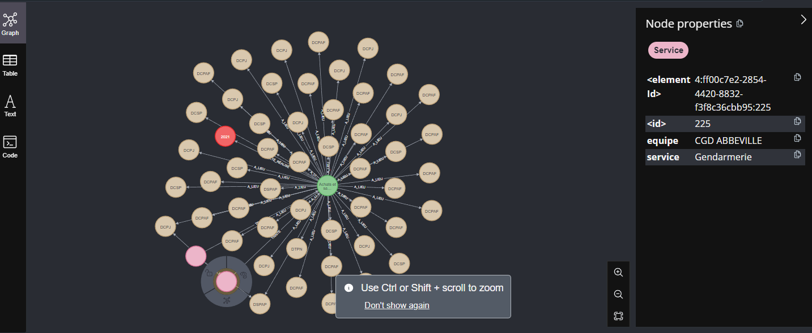
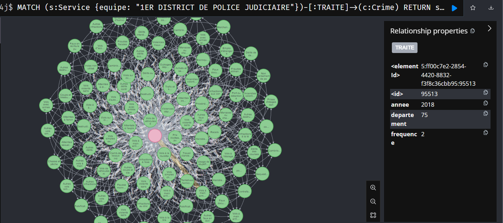

# 📊 Vérification et Exploitation du Graphe Neo4j


## 1- Afficher un sous-ensemble de nœuds et relations :

```cypher
// 25 pour la Police
MATCH (s:Service {service: 'Police'})-[:TRAITE]->(c:Crime)-[:A_LIEU]->(d:Département), (c)-[:A_ÉTÉ_RÉALISÉ]->(a:Année)
RETURN s, c, d, a
LIMIT 50

UNION

// 25 pour la Gendarmerie
MATCH (s:Service {service: 'Gendarmerie'})-[:TRAITE]->(c:Crime)-[:A_LIEU]->(d:Département), (c)-[:A_ÉTÉ_RÉALISÉ]->(a:Année)
RETURN s, c, d, a
LIMIT 50

```


## 2- Les 5 crimes les plus fréquents en 2022 (En l'absence de 2022, 2021) :

```cypher
MATCH (:Année {val: 2021})<-[:A_ÉTÉ_RÉALISÉ]-(c:Crime)<-[r:TRAITE]-(:Service)
RETURN c.nom AS crime, SUM(r.frequence) AS total
ORDER BY total DESC
LIMIT 5
```
╒══════════════════════════════════════════════════════════════════════╤══════╕
│crime                                                                 │total │
╞══════════════════════════════════════════════════════════════════════╪══════╡
│"Escroqueries et abus de confiance"                                   │314297│
├──────────────────────────────────────────────────────────────────────┼──────┤
│"Autres coups et blessures volontaires criminels ou correctionnels"   │311205│
├──────────────────────────────────────────────────────────────────────┼──────┤
│"Autres vols simples contre des particuliers dans des locaux ou lieux │280378│
│publics"                                                              │      │
├──────────────────────────────────────────────────────────────────────┼──────┤
│"Vols à la roulotte"                                                  │224299│
├──────────────────────────────────────────────────────────────────────┼──────┤
│"Usage de stupéfiants"                                                │201988│
└──────────────────────────────────────────────────────────────────────┴──────┘

---

## 3- Départements ayant enregistré le plus de vols entre 2015 et 2020 :

```cypher
MATCH (a:Année)<-[:A_ÉTÉ_RÉALISÉ]-(c:Crime)<-[r:TRAITE]-()-->(d:Département)
WHERE c.nom CONTAINS 'vol' AND a.val >= 2015 AND a.val <= 2020
RETURN d.nom AS departement, SUM(r.frequence) AS total_vols
ORDER BY total_vols DESC
LIMIT 10
```
╒═══════════╤══════════╕
│departement│total_vols│
╞═══════════╪══════════╡
│"75"       │4113522   │
├───────────┼──────────┤
│"13"       │1566432   │
├───────────┼──────────┤
│"59"       │1548636   │
├───────────┼──────────┤
│"92"       │1501218   │
├───────────┼──────────┤
│"69"       │1471248   │
├───────────┼──────────┤
│"93"       │1268004   │
├───────────┼──────────┤
│"33"       │1042212   │
├───────────┼──────────┤
│"94"       │1000860   │
├───────────┼──────────┤
│"31"       │873042    │
├───────────┼──────────┤
│"34"       │854130    │
└───────────┴──────────┘
---

## 4- Relations entre une brigade et les crimes qu’elle a traités :

```cypher
MATCH (s:Service {equipe: "1ER DISTRICT DE POLICE JUDICIAIRE"})-[:TRAITE]->(c:Crime)
RETURN s,c
```


```cypher
MATCH (s:Service {equipe: "1ER DISTRICT DE POLICE JUDICIAIRE"})-[t:TRAITE]->(c:Crime)
where t.frequence>0
Limit 15
RETURN s,t,c
```
╒══════════════════════════════════════════════════════════════════════╤═══════════════════════════════════════════════════════╤══════════════════════════════════════════════════════════════════════╕
│s                                                                     │t                                                      │c                                                                     │
╞══════════════════════════════════════════════════════════════════════╪═══════════════════════════════════════════════════════╪══════════════════════════════════════════════════════════════════════╡
│(:Service {service: "Police",equipe: "1ER DISTRICT DE POLICE JUDICIAIR│[:TRAITE {departement: "75",annee: 2019,frequence: 1}] │(:Crime {nom: "Aide à l'entrée, à la circulation et au séjour des étra│
│E"})                                                                  │                                                       │ngers"})                                                              │
├──────────────────────────────────────────────────────────────────────┼───────────────────────────────────────────────────────┼──────────────────────────────────────────────────────────────────────┤
│(:Service {service: "Police",equipe: "1ER DISTRICT DE POLICE JUDICIAIR│[:TRAITE {departement: "75",annee: 2019,frequence: 1}] │(:Crime {nom: "Atteintes aux intérêts fondamentaux de la Nation"})    │
│E"})                                                                  │                                                       │                                                                      │
├──────────────────────────────────────────────────────────────────────┼───────────────────────────────────────────────────────┼──────────────────────────────────────────────────────────────────────┤
│(:Service {service: "Police",equipe: "1ER DISTRICT DE POLICE JUDICIAIR│[:TRAITE {departement: "75",annee: 2020,frequence: 1}] │(:Crime {nom: "Atteintes sexuelles"})                                 │
│E"})                                                                  │                                                       │                                                                      │
├──────────────────────────────────────────────────────────────────────┼───────────────────────────────────────────────────────┼──────────────────────────────────────────────────────────────────────┤
│(:Service {service: "Police",equipe: "1ER DISTRICT DE POLICE JUDICIAIR│[:TRAITE {departement: "75",annee: 2019,frequence: 1}] │(:Crime {nom: "Atteintes sexuelles"})                                 │
│E"})                                                                  │                                                       │                                                                      │
├──────────────────────────────────────────────────────────────────────┼───────────────────────────────────────────────────────┼──────────────────────────────────────────────────────────────────────┤
│(:Service {service: "Police",equipe: "1ER DISTRICT DE POLICE JUDICIAIR│[:TRAITE {departement: "75",annee: 2018,frequence: 1}] │(:Crime {nom: "Atteintes sexuelles"})                                 │
│E"})                                                                  │                                                       │                                                                      │
├──────────────────────────────────────────────────────────────────────┼───────────────────────────────────────────────────────┼──────────────────────────────────────────────────────────────────────┤
│(:Service {service: "Police",equipe: "1ER DISTRICT DE POLICE JUDICIAIR│[:TRAITE {departement: "75",annee: 2020,frequence: 1}] │(:Crime {nom: "Atteintes à l'environnement"})                         │
│E"})                                                                  │                                                       │                                                                      │
├──────────────────────────────────────────────────────────────────────┼───────────────────────────────────────────────────────┼──────────────────────────────────────────────────────────────────────┤
│(:Service {service: "Police",equipe: "1ER DISTRICT DE POLICE JUDICIAIR│[:TRAITE {departement: "75",annee: 2021,frequence: 3}] │(:Crime {nom: "Atteintes à la dignité et à la  personnalité"})        │
│E"})                                                                  │                                                       │                                                                      │
├──────────────────────────────────────────────────────────────────────┼───────────────────────────────────────────────────────┼──────────────────────────────────────────────────────────────────────┤
│(:Service {service: "Police",equipe: "1ER DISTRICT DE POLICE JUDICIAIR│[:TRAITE {departement: "75",annee: 2020,frequence: 2}] │(:Crime {nom: "Atteintes à la dignité et à la  personnalité"})        │
│E"})                                                                  │                                                       │                                                                      │
├──────────────────────────────────────────────────────────────────────┼───────────────────────────────────────────────────────┼──────────────────────────────────────────────────────────────────────┤
│(:Service {service: "Police",equipe: "1ER DISTRICT DE POLICE JUDICIAIR│[:TRAITE {departement: "75",annee: 2019,frequence: 5}] │(:Crime {nom: "Atteintes à la dignité et à la  personnalité"})        │
│E"})                                                                  │                                                       │                                                                      │
├──────────────────────────────────────────────────────────────────────┼───────────────────────────────────────────────────────┼──────────────────────────────────────────────────────────────────────┤
│(:Service {service: "Police",equipe: "1ER DISTRICT DE POLICE JUDICIAIR│[:TRAITE {departement: "75",annee: 2018,frequence: 2}] │(:Crime {nom: "Atteintes à la dignité et à la  personnalité"})        │
│E"})                                                                  │                                                       │                                                                      │
├──────────────────────────────────────────────────────────────────────┼───────────────────────────────────────────────────────┼──────────────────────────────────────────────────────────────────────┤
│(:Service {service: "Police",equipe: "1ER DISTRICT DE POLICE JUDICIAIR│[:TRAITE {departement: "75",annee: 2017,frequence: 2}] │(:Crime {nom: "Atteintes à la dignité et à la  personnalité"})        │
│E"})                                                                  │                                                       │                                                                      │
├──────────────────────────────────────────────────────────────────────┼───────────────────────────────────────────────────────┼──────────────────────────────────────────────────────────────────────┤
│(:Service {service: "Police",equipe: "1ER DISTRICT DE POLICE JUDICIAIR│[:TRAITE {departement: "75",annee: 2016,frequence: 2}] │(:Crime {nom: "Atteintes à la dignité et à la  personnalité"})        │
│E"})                                                                  │                                                       │                                                                      │
├──────────────────────────────────────────────────────────────────────┼───────────────────────────────────────────────────────┼──────────────────────────────────────────────────────────────────────┤
│(:Service {service: "Police",equipe: "1ER DISTRICT DE POLICE JUDICIAIR│[:TRAITE {departement: "75",annee: 2016,frequence: 1}] │(:Crime {nom: "Attentats à l'explosif contre des biens privés"})      │
│E"})                                                                  │                                                       │                                                                      │
├──────────────────────────────────────────────────────────────────────┼───────────────────────────────────────────────────────┼──────────────────────────────────────────────────────────────────────┤
│(:Service {service: "Police",equipe: "1ER DISTRICT DE POLICE JUDICIAIR│[:TRAITE {departement: "75",annee: 2021,frequence: 33}]│(:Crime {nom: "Autres coups et blessures volontaires criminels ou corr│
│E"})                                                                  │                                                       │ectionnels"})                                                         │
├──────────────────────────────────────────────────────────────────────┼───────────────────────────────────────────────────────┼──────────────────────────────────────────────────────────────────────┤
│(:Service {service: "Police",equipe: "1ER DISTRICT DE POLICE JUDICIAIR│[:TRAITE {departement: "75",annee: 2020,frequence: 21}]│(:Crime {nom: "Autres coups et blessures volontaires criminels ou corr│
│E"})                                                                  │                                                       │ectionnels"})                                                         │
└──────────────────────────────────────────────────────────────────────┴───────────────────────────────────────────────────────┴──────────────────────────────────────────────────────────────────────┘


---

# 🌐 Visualisation Graphe : 

## 1-  Avantages et limites

Les avantages de la visualisation en graphe avec Neo4j sont les suivants : une vue claire des relations, une exploration facilitée et la possibilité d’exécuter des jointures complexes sans difficulté. Dans notre cas, l’analyse des crimes bénéficie particulièrement de cette approche, car elle permet de visualiser facilement les liens entre différentes unités et les crimes associés. Cependant, cette méthode est surtout pertinente pour des analyses ciblées, car tenter de visualiser l’ensemble du dataset peut rapidement devenir complexe.

Les ressources de l'utilisateur sont aussi à prendre en compte. Ici la prise de l'ensemble du jeu de données traitable par neo4j en 1 fois ne peut être affichée en raison d'un manque de puissance.

---
## 2-  Démo 

 Vidéo de démonstration sur un petit échantillon en raison du manque de puissance de l ordinateur.


```md
📹 [Voir la démo vidéo](media/TpDataviz.mp4)
```
 _Vidéo au format mp4 téléchargeable._


